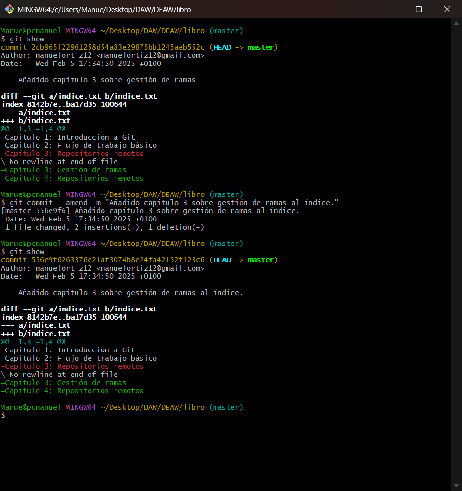
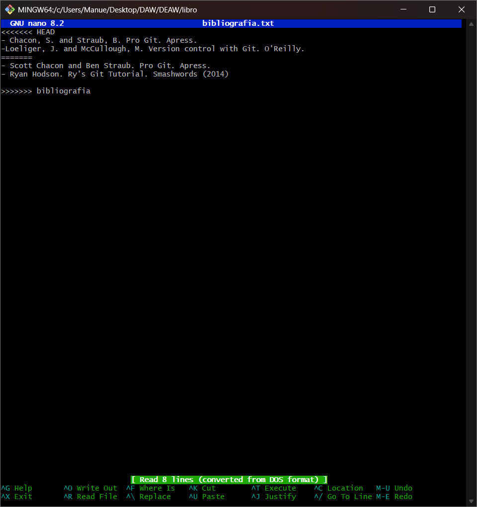
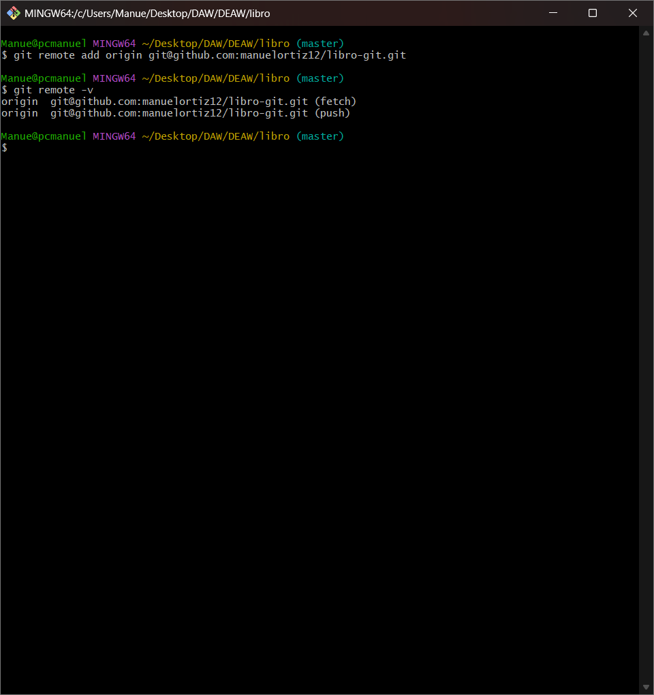

# Ejercicios Git y GitHub

## Repositorio DEAW
Crear un repositorio en vuestro GitHub llamado DEAW.


Y lo clonamos en local


## README
Creamos un archivo README.md


## Commit y push inicial


## Ignorar archivos
Creamos en el repositorio local un fichero llamado privado.txt y una carpeta "privada":


Creamos un archivo .gitignore en nuestro repositorio que incluye los nombres de archivos y directorios que no se subirán (se puede incluir el propio archivo para que este tampoco se suba):


## Crear el tag v0.1
Creamos un archivo llamado 1.txt
Creamos el tag v0.1 y subimos los cambios al repositorio remoto:


## Cuenta de GitHub
Así cambiamos nuestra foto de perfil:


Y de la siguiente forma añadimos el doble factor de autentificación en nuestra cuenta:


## Uso social de GitHub
Seguimos a 2 compañeros de clase en github:


Seguimos los repositorios DEAW de mis compañeros y le damos una estrella:


## Colaboradores
Añadimos a uno de ellos de colaborador de nuestro repositorio DEAW:


## Crear una rama v0.2
Vamos a crear una rama llamada v0.2, en la cual crearemos un archivo 2.txt y lo subiremos al repositorio remoto en su respectiva rama: 


## Merge directo
Nos posicionamos en la rama master y hacemos un merge de la rama v0.2 en la rama master:


## Merge con conflicto
En la rama master poner Hola en el fichero 1.txt y hacer commit.


Posicionarse en la rama v0.2 y poner Adios en el fichero "1.txt" y hacer commit.


Posicionarse de nuevo en la rama master y hacer un merge con la rama v0.2


## Listado de ramas


## Arreglar conflicto
Arreglamos el conflicto:


## Borrar rama
Crear un tag v0.2


Borrar la rama v0.2


## Listado de cambios


# Ejercicios de creación y actualización de repositorios

## Ejercicio 1
Configurar Git definiendo el nombre del usuario, el correo electrónico y activar el coloreado de la salida.


Mostrar la configuración final.

## Ejercicio 2
Crear un repositorio nuevo con el nombre `libro` y mostrar su contenido.


## Ejercicio 3
Comprobar el estado del repositorio.

Crear un fichero `indice.txt` con el siguiente contenido:

```
Capítulo 1: Introducción a Git
Capítulo 2: Flujo de trabajo básico
Capítulo 3: Repositorios remotos
```


Comprobar de nuevo el estado del repositorio.

Añadir el fichero a la zona de intercambio temporal.

Volver a comprobar una vez más el estado del repositorio.


## Ejercicio 4
Realizar un commit de los últimos cambios con el mensaje “Añadido índice del libro.” y ver el estado del repositorio.


## Ejercicio 5
Cambiar el fichero `indice.txt` para que contenga lo siguiente:

```
Capítulo 1: Introducción a Git
Capítulo 2: Flujo de trabajo básico
Capítulo 3: Gestión de ramas
Capítulo 4: Repositorios remotos
```


Mostrar los cambios con respecto a la última versión guardada en el repositorio.

Hacer un commit de los cambios con el mensaje “Añadido capítulo 3 sobre gestión de ramas”.


## Ejercicio 6
Mostrar los cambios de la última versión del repositorio con respecto a la anterior.

Cambiar el mensaje del último commit por “Añadido capítulo 3 sobre gestión de ramas al índice.”

Volver a mostrar los últimos cambios del repositorio.



---

# Ejercicios de manejo del historial de cambios

## Ejercicio 1
Mostrar el historial de cambios del repositorio.

Crear la carpeta `capitulos` y crear dentro de ella el fichero `capitulo1.txt` con el siguiente texto:

```
Git es un sistema de control de versiones ideado por Linus Torvalds.
```


Añadir los cambios a la zona de intercambio temporal.

Hacer un commit de los cambios con el mensaje “Añadido capítulo 1.”

Volver a mostrar el historial de cambios del repositorio.


## Ejercicio 2
Crear el fichero `capitulo2.txt` en la carpeta `capitulos` con el siguiente texto:

```
El flujo de trabajo básico con Git consiste en:
1- Hacer cambios en el repositorio.
2- Añadir los cambios a la zona de intercambio temporal.
3- Hacer un commit de los cambios.
```


Añadir los cambios a la zona de intercambio temporal.

Hacer un commit de los cambios con el mensaje “Añadido capítulo 2.”

Mostrar las diferencias entre la última versión y dos versiones anteriores.


## Ejercicio 3
Crear el fichero `capitulo3.txt` en la carpeta `capitulos` con el siguiente texto:

```
Git permite la creación de ramas lo que permite tener distintas versiones del mismo proyecto y trabajar de manera simultanea en ellas.
```


Añadir los cambios a la zona de intercambio temporal.

Hacer un commit de los cambios con el mensaje “Añadido capítulo 3.”

Mostrar las diferencias entre la primera y la última versión del repositorio.


## Ejercicio 4
Añadir al final del fichero `indice.txt` la siguiente línea:

```
Capítulo 5: Conceptos avanzados
```

Añadir los cambios a la zona de intercambio temporal.

Hacer un commit de los cambios con el mensaje “Añadido capítulo 5 al índice.”

Mostrar quién ha hecho cambios sobre el fichero `indice.txt`.

---


# Ejercicios de deshacer cambios

## Ejercicio 1
Eliminar la última línea del fichero `indice.txt` y guardarlo.


Comprobar el estado del repositorio.

Deshacer los cambios realizados en el fichero `indice.txt` para volver a la versión anterior del fichero.

Volver a comprobar el estado del repositorio.


## Ejercicio 2
Eliminar la última línea del fichero `indice.txt` y guardarlo.


Añadir los cambios a la zona de intercambio temporal.

Comprobar de nuevo el estado del repositorio.

Quitar los cambios de la zona de intercambio temporal, pero mantenerlos en el directorio de trabajo.

Comprobar de nuevo el estado del repositorio.

Deshacer los cambios realizados en el fichero `indice.txt` para volver a la versión anterior del fichero.

Volver a comprobar el estado del repositorio.


## Ejercicio 3
Eliminar la última línea del fichero `indice.txt` y guardarlo.

Eliminar el fichero `capitulos/capitulo3.txt`.

Añadir un fichero nuevo `capitulos/capitulo4.txt` vacío.


Añadir los cambios a la zona de intercambio temporal.

Comprobar de nuevo el estado del repositorio.

Quitar los cambios de la zona de intercambio temporal, pero mantenerlos en el directorio de trabajo.

Comprobar de nuevo el estado del repositorio.

Deshacer los cambios realizados para volver a la versión del repositorio.

Volver a comprobar el estado del repositorio.


## Ejercicio 4
Eliminar la última línea del fichero `indice.txt` y guardarlo.


Eliminar el fichero `capitulos/capitulo3.txt`.

Añadir los cambios a la zona de intercambio temporal y hacer un commit con el mensaje “Borrado accidental.”

Comprobar el historial del repositorio.

Deshacer el último commit pero mantener los cambios anteriores en el directorio de trabajo y la zona de intercambio temporal.

Comprobar el historial y el estado del repositorio.

Volver a hacer el commit con el mismo mensaje de antes.

Deshacer el último commit y los cambios anteriores del directorio de trabajo volviendo a la versión anterior del repositorio.

Comprobar de nuevo el historial y el estado del repositorio.


---

# Ejercicios de gestión de ramas

## Ejercicio 1
Crear una nueva rama `bibliografia` y mostrar las ramas del repositorio.


## Ejercicio 2
Crear el fichero `capitulos/capitulo4.txt` y añadir el texto siguiente:

```
En este capítulo veremos cómo usar GitHub para alojar repositorios en remoto.
```


Añadir los cambios a la zona de intercambio temporal.

Hacer un commit con el mensaje “Añadido capítulo 4.”

Mostrar la historia del repositorio incluyendo todas las ramas.


## Ejercicio 3
Cambiar a la rama `bibliografia`.

Crear el fichero `bibliografia.txt` y añadir la siguiente referencia:

```
Chacon, S. and Straub, B. Pro Git. Apress.
```


Añadir los cambios a la zona de intercambio temporal.

Hacer un commit con el mensaje “Añadida primera referencia bibliográfica.”

Mostrar la historia del repositorio incluyendo todas las ramas.


## Ejercicio 4
Fusionar la rama `bibliografia` con la rama `master`.


Mostrar la historia del repositorio incluyendo todas las ramas.

Eliminar la rama `bibliografia`.

Mostrar de nuevo la historia del repositorio incluyendo todas las ramas.


## Ejercicio 5
Crear la rama `bibliografia`.

Cambiar a la rama `bibliografia`.

Cambiar el fichero `bibliografia.txt` para que contenga las siguientes referencias:

```
Scott Chacon and Ben Straub. Pro Git. Apress.
Ryan Hodson. Ry’s Git Tutorial. Smashwords (2014)
```


Añadir los cambios a la zona de intercambio temporal y hacer un commit con el mensaje “Añadida nueva referencia bibliográfica.”

Cambiar a la rama `master`.

Cambiar el fichero `bibliografia.txt` para que contenga las siguientes referencias:

```
Chacon, S. and Straub, B. Pro Git. Apress.
Loeliger, J. and McCullough, M. Version control with Git. O’Reilly.
```

Añadir los cambios a la zona de intercambio temporal y hacer un commit con el mensaje “Añadida nueva referencia bibliográfica.”

Fusionar la rama `bibliografia` con la rama `master`.

Resolver el conflicto dejando el fichero `bibliografia.txt` con las referencias:

```
Chacon, S. and Straub, B. Pro Git. Apress.
Loeliger, J. and McCullough, M. Version control with Git. O’Reilly.
Hodson, R. Ry’s Git Tutorial

```


Añadir los cambios a la zona de intercambio temporal y hacer un commit con el mensaje “Resuelto conflicto de bibliografía.”

Mostrar la historia del repositorio incluyendo todas las ramas.





---

# Ejercicios de repositorios remotos
## Ejercicio 1
Crear un nuevo repositorio público en GitHub con el nombre libro-git.

Añadirlo al repositorio local del libro.

Mostrar todos los repositorios remotos configurados.





## Ejercicio 2
Añadir los cambios del repositorio local al repositorio remoto de GitHub.

Acceder a GitHub y comprobar que se han subido los cambios mostrando el historial de versiones.


